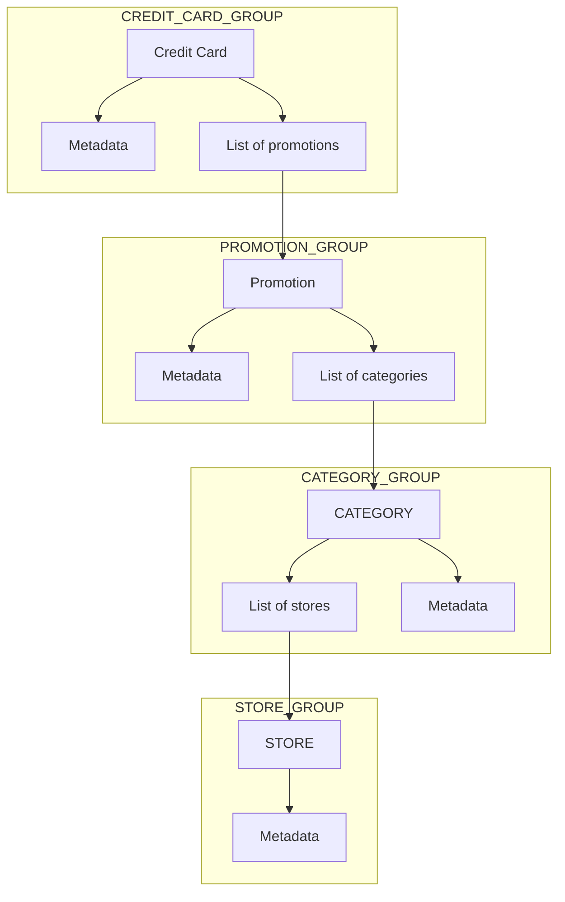

# Common Concept

## Objective

Avoid repetitive declarations of common concepts across various systems.

## Design

### Credit Card

The `CreditCard` concept represents all the information about a single credit card.

### Promotion

The `Promotion` concept represents all the information about a single promotion of a credit card.

### Category

The `Category` concept represents a type of stores.

### Store

The `Store` concept represents a specific merchant or shop.
