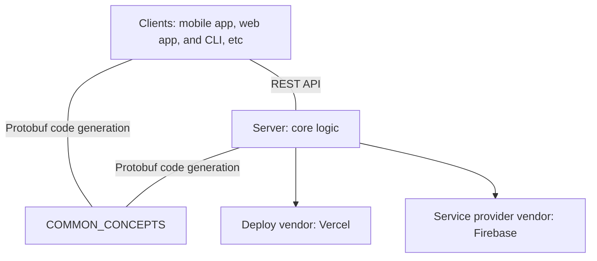

# Product Design

## Objective

**Credit Card Optimizer** aims to be a customizable credit card search & recommendation engine that help users optimize credit card benefits.

## Background

As online and in-store promotions has become more common, there are many utilities apps that help users search available coupons or recommend coupons

However, although almost every transaction goes through credit cards, the benefits that comes with the payment method itself is often overlooked.

With the correct combination of credit cards and strategies, the reward can be significantly optimized.

This project aims to help user manage credit cards and optimize reward with algorithms.

## Summary

The product functions like a GitHub for credit cards where each users can have repositories, but repositories are limited to the following categories:

* A store: a entity where users can make a purchase. For example, Costco or more specifically Costco near my house.
* A category: a set of business that aligns with how credit card companies define quarterly benefits. For example, streaming services.
* A promotion: a benefit of a credit card. For example, 5% cashback for streaming services in second quarter.
* A credit card: a credit card with promotions. For example, Chase Freedom Flex.
* A wallet: a collection of credit cards used to compute the optimal method of payment.

## Design

